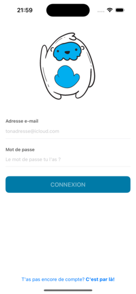
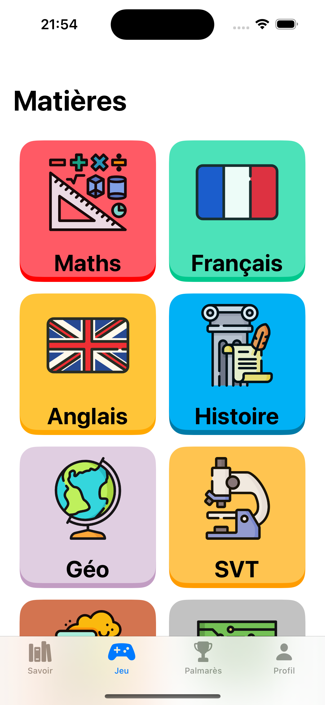
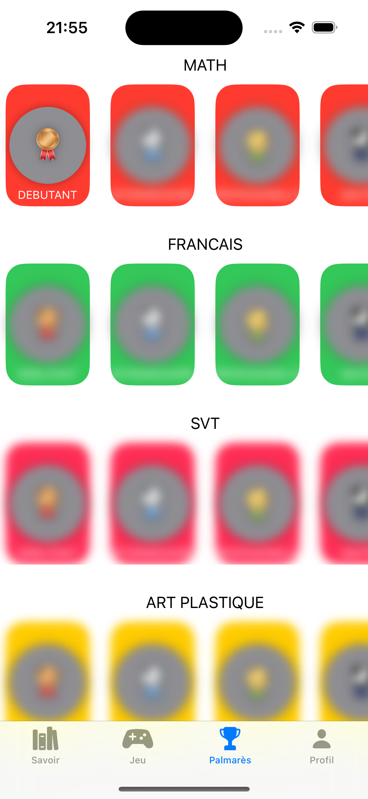

# Nom de l'application

## 📖 Présentation

Cette application est un **projet de démonstration** développé afin de présenter les fonctionnalités d'une application moderne ainsi que les choix techniques réalisés lors de son développement.

Son objectif n'est pas d'être un produit final, mais de servir d'exemple pour illustrer l'architecture du projet, l'expérience utilisateur et les différentes fonctionnalités mises en place.

---

## 🖼️ Captures d'écran

### Authentification

> Écran de connexion permettant à l'utilisateur de s'authentifier.

### Menu principal

> Vue d'ensemble des principales fonctionnalités disponibles.

### Système de trophées

> Exemple des trophées que l'utilisateur peut débloquer au fil de son utilisation de l'application.

### Autres captures

Vous pouvez ajouter autant de captures d'écran que nécessaire afin de présenter les différentes fonctionnalités de l'application.

---

## ⚠️ Réutilisation du projet

Si vous souhaitez réutiliser cette application, gardez à l'esprit les points suivants :

- Cette application est avant tout un projet de démonstration.
- Certaines fonctionnalités peuvent nécessiter une configuration supplémentaire avant d'être utilisées.
- Pensez à adapter les variables d'environnement (`.env`) à votre propre environnement.
- Les clés API, identifiants ou autres informations sensibles ne sont pas incluses dans le dépôt.
- Le projet peut être modifié et adapté selon vos besoins.

---

## 🚀 Installation

En cours de redaction
